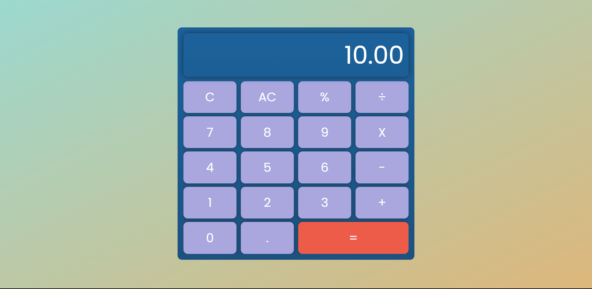

# Simple Calculator

This is a simple calculator web application created using HTML, CSS, and JavaScript. It allows users to perform basic arithmetic operations such as addition, subtraction, multiplication, and division.



You can try out the Calculator by visiting the live demo here: [Simple Calculator Demo](https://amalrajkp18.github.io/webCalculator/)

## Features

- Addition (+)
- Subtraction (-)
- Multiplication (*)
- Division (/)
- Modulo (%)

## Technologies Used

- HTML5
- CSS3
- JavaScript

## Usage

1. **Clone the repository:** Clone this repository to your local machine using the following command:

   ```
   git clone https://github.com/your-username/calculator.git

1. Open the `index.html` file in your web browser.
2. Interact with the keyboard:
    - Click on the virtual keys to input characters.
    - The keyboard includes standard alphanumeric keys, as well as special keys like Shift, Caps Lock, and Backspace.
    - The virtual keyboard can be used as an input method for text fields and text areas on websites.

## Contact

If you have any questions, suggestions, or feedback, please feel free to contact us at [amalrajkp18official@gmail.com](mailto:amalrajkp18official@gmail.com).

